# TopLifeMiami-Nivel-de-gua
Projeto para monitoramento de nível de água do Miami Beach

## Conceito

Utilizar um Sensor ultrassonico para medir o que falta de água no tanque, e calcular o que tem de água.
Então, exibir a medida atual na tela e a cada período de tempo, publicar os dados na internet.

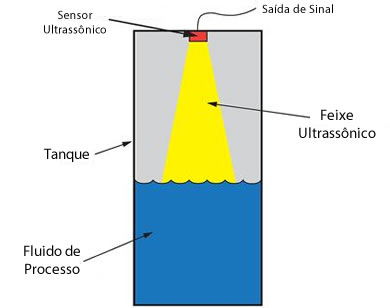

Foram explorados três métodos de publicação na Internet:

- Plataforma **Adafruit.io**, um broquer MQTT popular em projetos de automação
- Um site particular, representando um sistema hospedado na nuvem
- API do telegram, enviando mensagens periódicas, representando um sistema de alerta

## Material utilizado

> Nota: Alguns materiais, como cano e cabo, podem ser adquiridos por metro, diminuindo o custo. Ou mesmo utilizar resto que já exista em estoque.

### Itens Essenciais

#### Sensor de Ultrassom
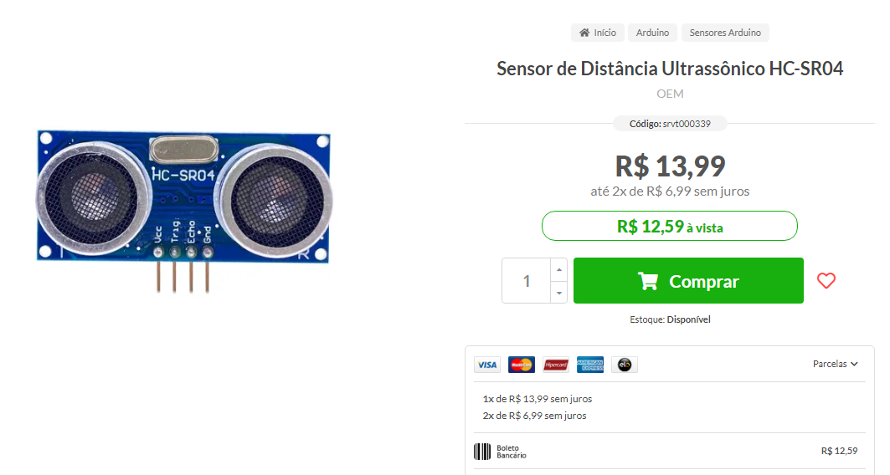

#### Microcontrolador com WiFi
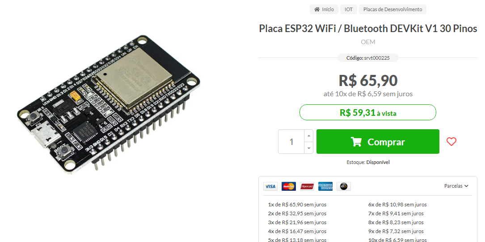

#### Carregador de Celular com cabo microusb
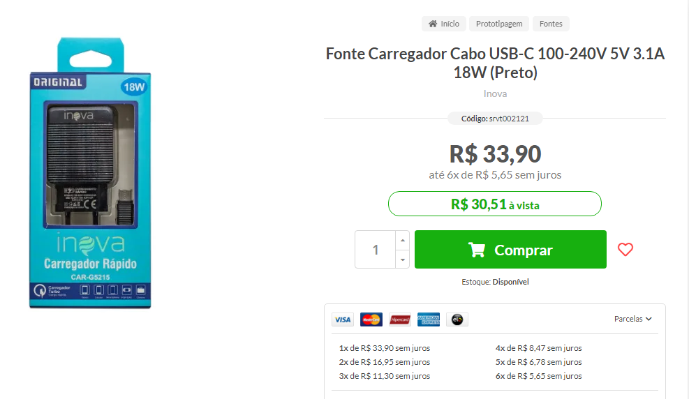

### Itens opcionais e/ou acabamento do projeto

#### Tela de OLED
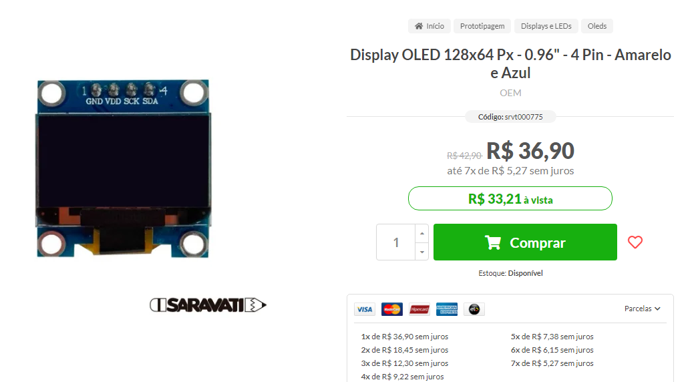

#### Cabo para conexão com a Tela e adaptação do sensor
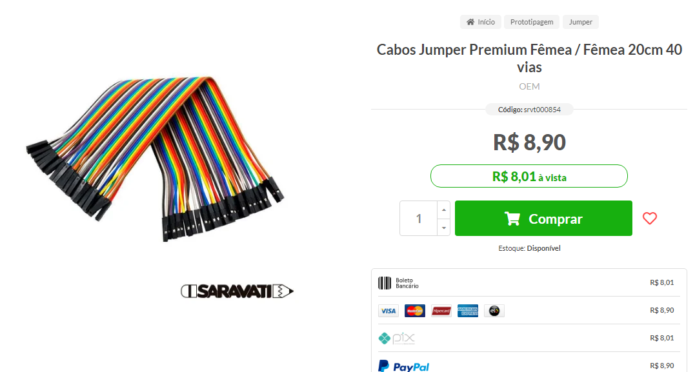

#### Tubo para isolamento de emendas

> Ou use fita isolante

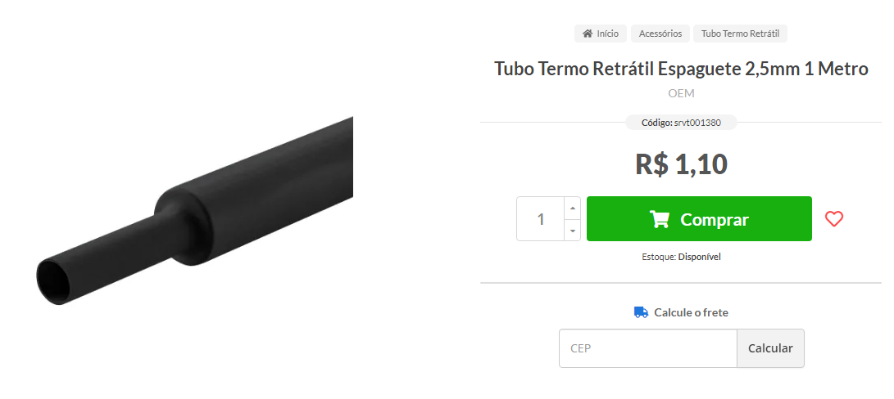

#### Cabo para conextar o sensor da caixa ao controlador
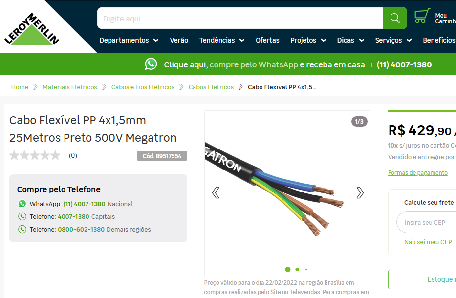

#### Pode ser utilizado cabo de rede, em vez de cobo anterior
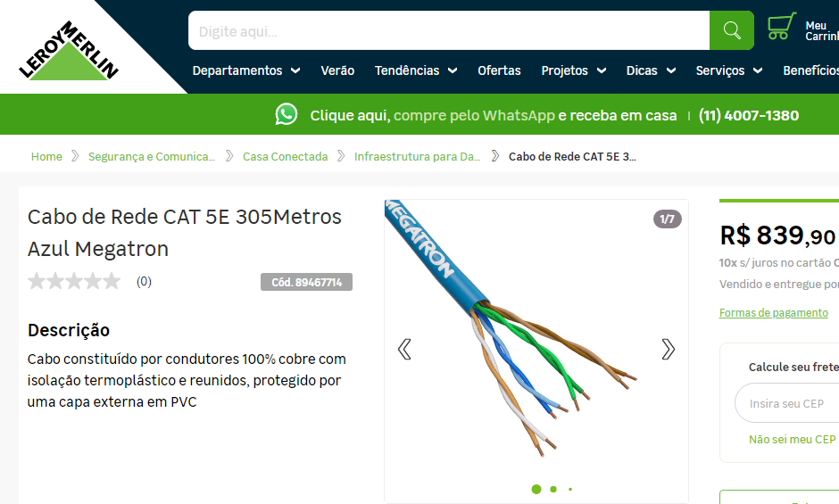

#### CAP 50mm Esgoto, com anel de vedação
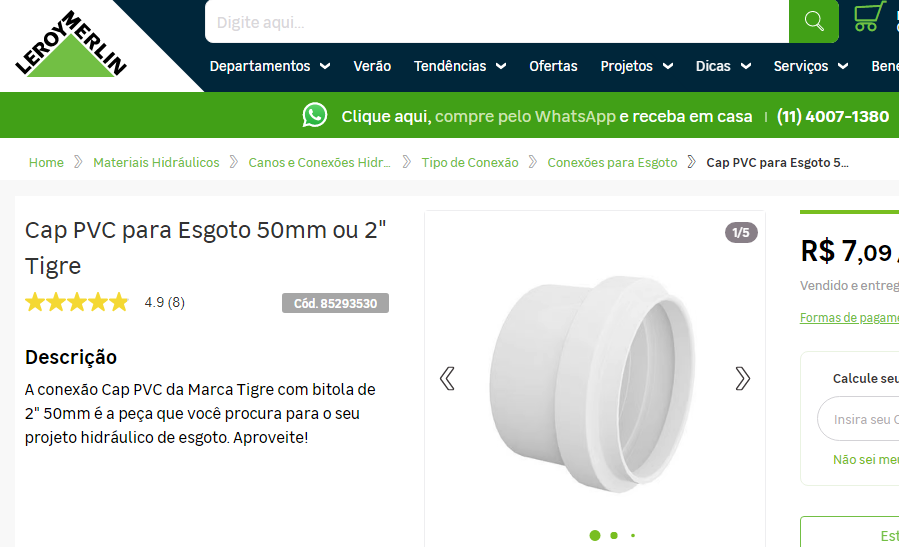
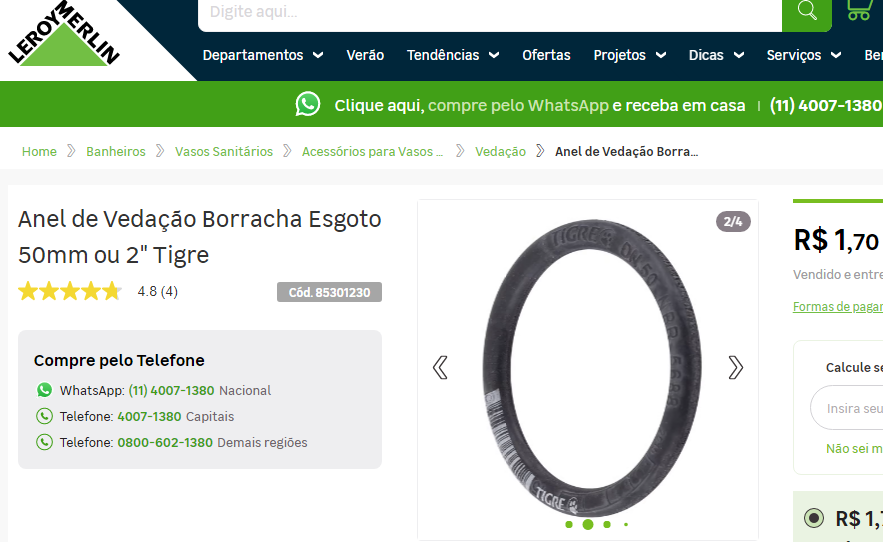

> Nota: Se for utilizar o sensor impermeável, substituir esses dois itens e a redução de 50/25 por um cap de 25.

#### Redução 50/25mm água
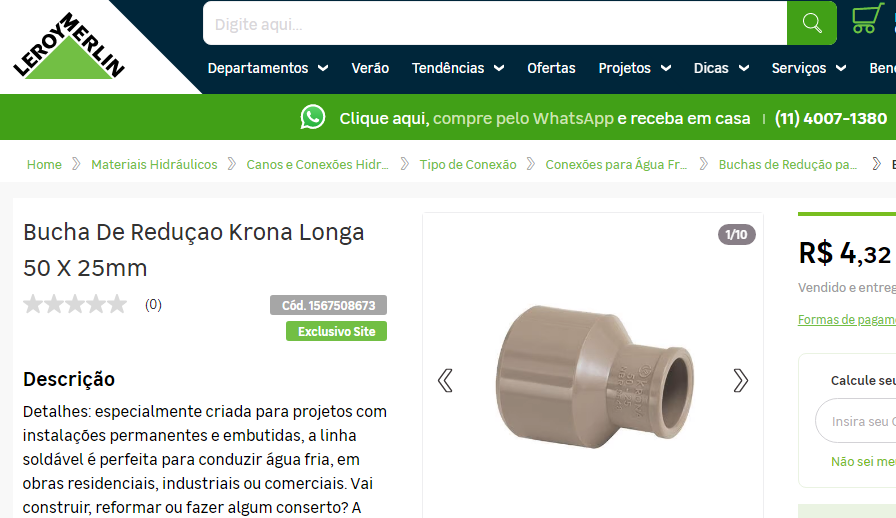

#### Pedaço de cano de 25mm
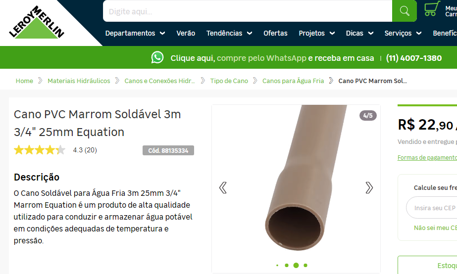

#### Caixa de sobrepor com tampa cega
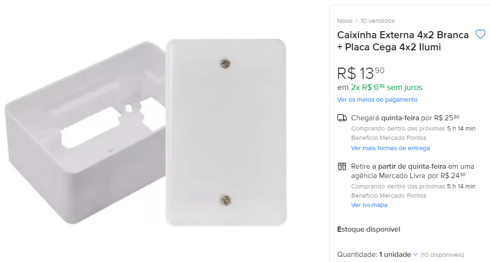
Para instalar o LCD e acomodar o ESP32
