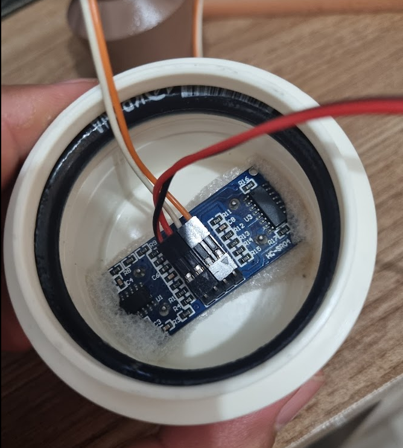

# TopLifeMiami-Nivel-de-gua
Projeto para monitoramento de nível de água do Miami Beach

## Conceito

Utilizar um Sensor ultrassonico para medir o que falta de água no tanque, e calcular o que tem de água.
Então, exibir a medida atual na tela e a cada período de tempo, publicar os dados na internet.

Foram explorados três métodos de publicação na Internet:

- Plataforma **Adafruit.io**, um broquer MQTT popular em projetos de automação
- Um site particular, representando um sistema hospedado na nuvem
- API do telegram, enviando mensagens periódicas, representando um sistema de alerta

## Material RECOMENDADO

> Nota: Alguns materiais, como cano e cabo, podem ser adquiridos por metro, diminuindo o custo. Ou mesmo utilizar resto que já exista em estoque.

### Itens Essenciais

#### Sensor de Ultrassom

#### Microcontrolador com WiFi

#### Carregador de Celular com cabo microusb

### Itens opcionais e/ou acabamento do projeto

#### Tela de OLED

#### Cabo para conexão com a Tela e adaptação do sensor

#### Tubo para isolamento de emendas

> Ou use fita isolante

#### Cabo para conextar o sensor da caixa ao controlador

#### Pode ser utilizado cabo de rede, em vez de cobo anterior

#### CAP 50mm Esgoto, com anel de vedação

> Nota: Se for utilizar o sensor impermeável, substituir esses dois itens e a redução de 50/25 por um cap de 25.

#### Redução 50/25mm água

#### Pedaço de cano de 25mm

#### Caixa de sobrepor com tampa cega

Para instalar o LCD e acomodar o ESP32

## Execução do projeto

> O código fonte do programa está neste projeto.

- Copie o código do programa para o seu computador
- Instale a IDE Arduino, e instale as Bibliotecas Adafruit MQTT, Ultrassoinic, SSD1306
- Crie um bot no Telegram, crie um char e anote o token e o id do Chat
- Crie uma conta na Adafruit e anote o token
- Crie um site que tenha uma página que recebe dois parametros, Sendo ID do Sensor e Valor

#### A montagem das peças:

Fure o CAP de modo que o sensor encaixe bem justo

Utilize algum material para servir de apoio ao sensor. Eu utilizei um pedaço de isopor

Ajuste a altura pra sona não ficar muito pra fora

Faça as emendas necessárias e ANOTE a sequencia correta dos fios, seguindo o codigo do projeto

Encaise o cap, a redução e um pedaço de cano, com o já conectado ao sensor e fixe na caixa. A Sonda não deve encostar na água

Com uma trena, meça quantos centimetros tem entre a sonda e o nivel maximo da água. Essa informação deve ser inserida no programa antes de gravar.

Faça os acabamentos necessários. Esta etapa pode variar de caso a caso.

Na casa de máquinas, ou onde for ficar o microcontrolador, faça as conexões conforme o projeto

Imagem do armário na casa de máquinas.

> É verdade, ficou bem feio mas vamos logo mais acomodar em uma caixa de sobrepor e prender a tela na tampa cega.
